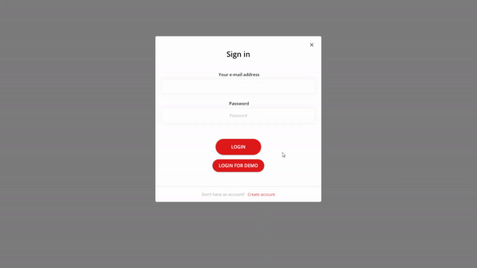
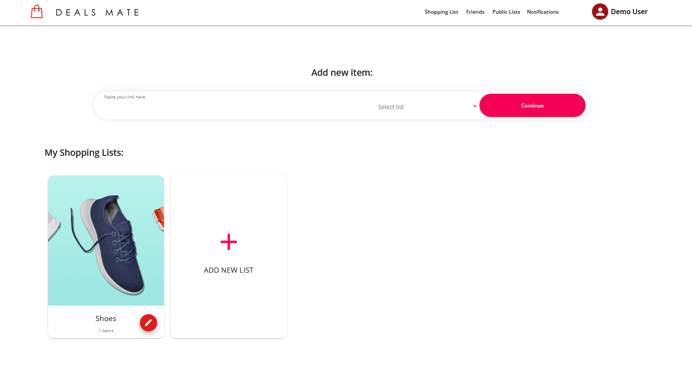
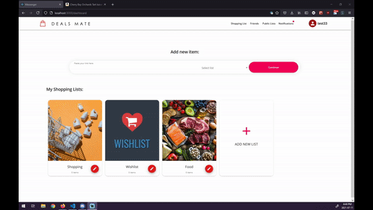
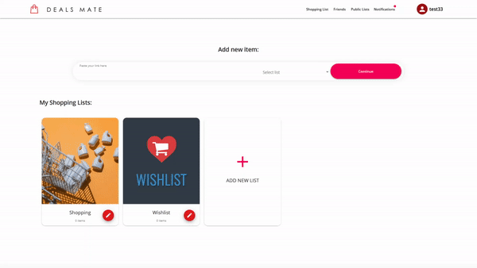
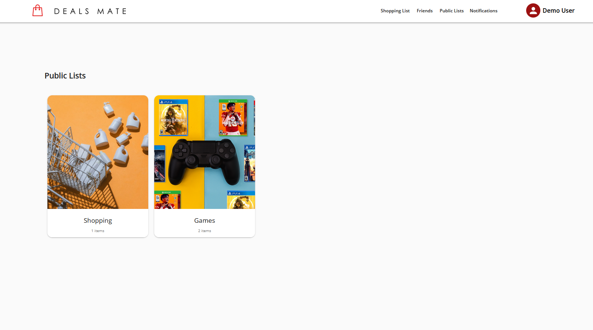
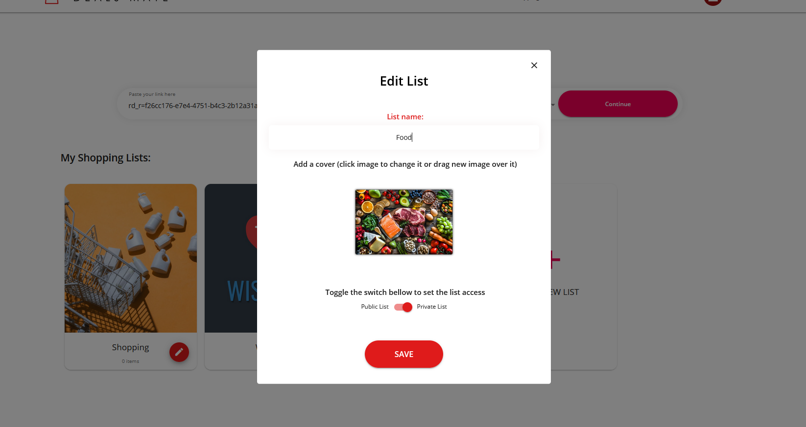

# DealsMate


## About
DealsMate is a web-app that allows users to save items from Amazon, Ebay and Craigslist to lists, then keeps the user updated on price drops for all the items. Users can also follow each other and each other's lists.

###  **Tech Stack**
**MERN** (**M**ongo, **E**xpress, **R**eact, **N**ode)

| Other Highlights |
|-|
| Material ui |
| TypeScript |
| socket.io |
| Cloudinary Image upload |
| Redis |
| puppeteer |
| Formik |


### **Contributors** 
[Marouane Er-Rouhi](https://github.com/marouane-erouhi) and [Christian Barnabé](https://github.com/christian-barnabe-chabi) with the help and guidence of the [Hatchways Team](https://github.com/hatchways)

---

## Setup guide
### Prerequisites
You will need NodeJs installed and a link to a mongoDB database if you want to run it localy.
This project was built on the following node version
```
$ node --version
v14.15.3
```
Make sure to duplicate and rename the `server/sample.env` to `server/.env` and fill out all required fields
### Getting Started

1. Clone or download repository

---

## Server

1. Go into the server director `cd server`
2. Run `npm install` to install packages
3. Make sure your environment variable (.env) file is setup (refer to [Prerequisites](#Prerequisites) section)
4. Run `npm run dev` to start the server

---

## Client

1. Go into the client directory `cd client`
2. Run `npm install` to install packages
3. Run `npm start` to start the client side

---

### Demo

1. Registration. Users will be able to create a new account using their email and password



2. Dashboard. The user will be able to add links to their lists, inspect their lists and create a new list



3. Add new Item. User can add a link to a list 



4. Add new List. User will be able to add new list with a name and a cover image


5. Followers. The user will be able to follow new suggested users and unfollow users they already follow



6. Public Lists. The user will be able to see all public lists on the platform



7. Delete Item. User can remoev an item from a list


8. Edit List. User can edit properties of a list




